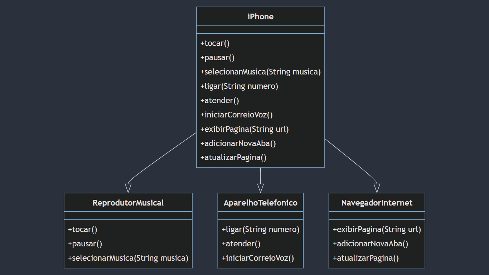

# POO - Desafio: Modelagem e Diagramação de um Componente iPhone

### Descrição
Este projeto é a minha solução para o desafio de modelar e diagramar a representação UML do componente iPhone, abrangendo suas funcionalidades como Reprodutor Musical, Aparelho Telefônico e Navegador na Internet. A modelagem foi baseada no vídeo de lançamento do iPhone de 2007.
#### Modelagem e Diagramação de um Componente iPhone

### Ferramentas Utilizadas
- [Lucidchart](https://www.lucidchart.com/) para criação do diagrama UML.
- [IntelliJ](https://www.jetbrains.com/idea/) IDEA para desenvolvimento em Java.

### Considerações Finais
Esta foi a minha solução para o desafio proposto. O diagrama UML e a implementação em Java seguem as especificações fornecidas e representam as funcionalidades do iPhone conforme descrito no exercício.
